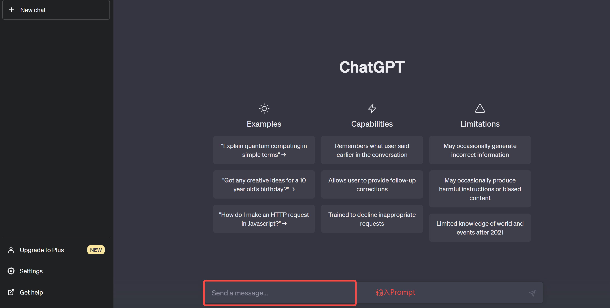
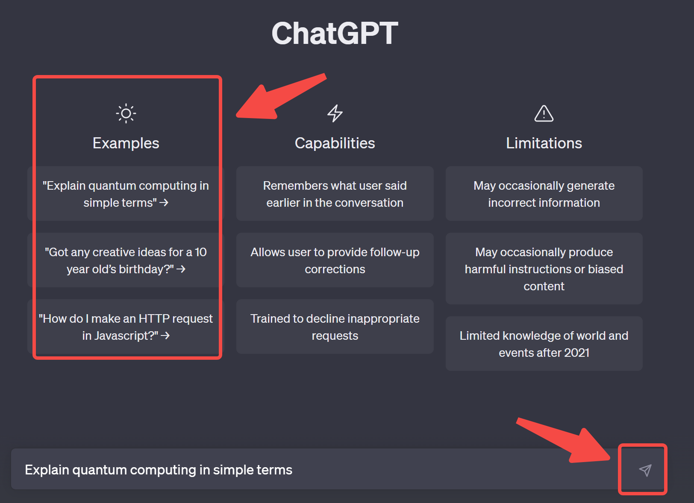
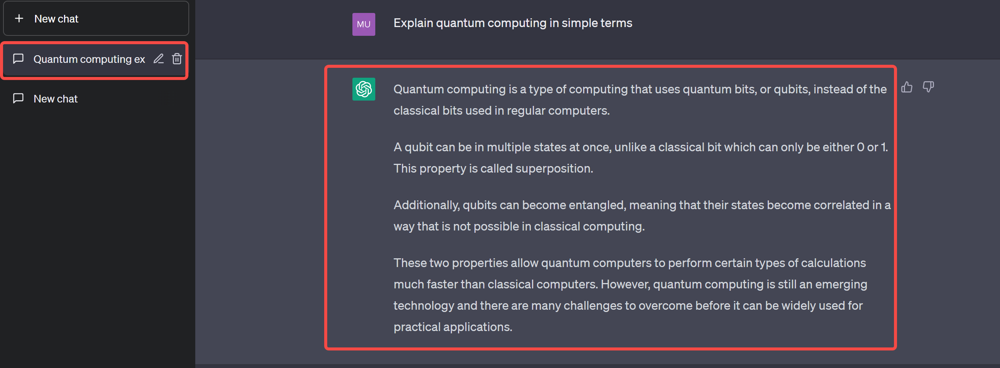

**GPT介绍**

**ChatGPT 简介**

**ChatGPT是基于GPT（Generative Pre-trained
Transformer）的聊天型AI模型**，由OpenAI团队开发。它的核心是GPT模型，这是一种基于Transformer的神经网络模型，能够对文本进行自动编码和生成。

ChatGPT是一种人工智能技术，它被训练来进行自然语言理解和生成。简单来说，它是一种能够进行智能对话的计算机程序。它使用的是一种叫做GPT的算法，这种算法可以根据已有的数据来生成新的语言信息，就像我们人类学习语言一样。

使用ChatGPT，你可以像和一个人一样进行对话，它可以回答你的问题、提供建议、给你意见等等。这项技术的应用非常广泛，可以用于聊天机器人、虚拟助手、客户服务等等领域。

ChatGPT背后的技术很复杂，但是它的基本原理还是比较容易理解的。它的核心是一个深度学习模型，这个模型会被训练来理解人类语言，同时也可以生成类似人类的回复。为了训练这个模型，我们需要大量的文本数据，这些数据被称为"语料库"。

在训练模型的过程中，模型会学习到不同单词和短语之间的关系，以及如何将它们组合成有意义的句子。当你与ChatGPT进行对话时，它会根据你的输入来生成回复，这个回复会基于它在训练时学习到的知识和规律。因此，ChatGPT的回答可能并不总是完美的，但是它可以不断地从错误中学习，逐渐提高自己的表现。

总之，ChatGPT是一种非常有趣和实用的技术，它可以让计算机像人类一样进行对话，并且可以用于很多不同的领域。虽然它背后的技术很复杂，但是它的应用却是非常容易理解的。

**技术背景**

GPT-4架构：GPT-4是OpenAI的一种大型预训练语言模型，是GPT系列的第四代。GPT-4在大量文本数据上进行训练，使其具有强大的理解和生成语言的能力。GPT-4架构基于自注意力和Transformer结构，有效处理长距离依赖和复杂语义关系。

Transformer：Transformer是一种深度学习模型，基于自注意力机制，可以并行处理输入序列中的所有单词。相较于传统的循环神经网络（RNN）和长短时记忆网络（LSTM），Transformer具有更高的计算效率和表现力。

自注意力：自注意力机制是Transformer的核心组件，它可以识别输入序列中各个单词之间的关系。自注意力通过为每个单词分配权重来计算上下文相关的表示，使模型能够捕捉长距离依赖和复杂语义关系。

**训练过程**

ChatGPT的训练分为两个阶段：预训练和微调。

**预训练：**在预训练阶段，模型在大量的文本数据上进行无监督学习。这些数据包括网页、书籍、文章等，来源广泛且多样。模型通过学习这些数据，掌握语言的结构和语义知识。

**微调：**在微调阶段，模型使用有标签的数据进行监督学习。这些数据包括对话、问题回答等，帮助模型更好地适应特定任务和场景。微调使模型能够更准确地理解和生成目标领域的语言。

**应用场景**

ChatGPT可以应用于各种场景，包括：

**问题回答：**为用户提供准确的问题解答，涵盖广泛的领域。

**文本生成：**帮助用户撰写文章、邮件、社交媒体等各种文本内容。

**情感分析：**根据用户输入的文本，分析其中的情感倾向，如积极、消极等。

**摘要生成：**为长篇文章生成简洁的摘要，帮助用户快速了解关键信息。

**机器翻译：**将一种语言的文本翻译成另一种语言，支持多种语言之间的翻译。

**代码生成：**根据用户的需求自动生成代码，支持多种编程语言。

**教育辅导：**为学生提供学术帮助，解答各种课题问题。

**客户支持：**为用户提供实时的在线客户服务，解决各种问题。

**局限性与挑战**

尽管ChatGPT具有很高的准确性和灵活性，但它仍然存在一些局限性和挑战：

**数据偏见：**由于训练数据来源于现实世界，模型可能会学到一些不准确或具有偏见的知识。

**知识时效性：**ChatGPT的知识截至2021年9月，无法获取之后的信息和事件。

**不准确的回答**：在某些情况下，模型可能会生成不准确或无关的回答。

**欠缺解释能力：**模型生成的回答可能难以追踪和解释，原因在于Transformer架构的黑箱特性。

**安全隐患：**模型可能会生成不适当或有害的内容，需要有效的过滤和限制机制。

**未来发展**

随着AI技术的不断发展，ChatGPT及其衍生模型将在以下方面取得进步：

**模型规模：**未来的GPT模型可能会进一步增大参数量，以提高性能和泛化能力。同时，这也将带来更大的计算资源需求和能源消耗。

**训练数据：**未来的GPT模型可能会利用更多样化、高质量和平衡的训练数据，以减轻数据偏见和提高模型的表现。

**微调和适应性：**通过更有效的微调方法，未来的GPT模型将能够更好地适应各种任务和场景，提高在特定领域的表现。

**可解释性：**为了让GPT模型的决策过程更加透明，研究人员将继续探索可解释性AI技术，以便更好地理解模型的工作原理。

**安全性和伦理：**随着模型性能的提升，安全性和伦理问题也将变得更加重要。研究人员将继续关注如何减轻模型偏见、限制不当内容生成以及确保AI技术的道德和责任使用。

**节能和可持续性：**随着模型规模的扩大，能源消耗和环境影响将成为关注焦点。研究人员将探索更节能、可持续的模型训练方法。

总之，GPT系列模型在自然语言处理领域取得了显著的成果，未来的发展将继续推动AI技术的进步，同时应对伦理、安全、可解释性等方面的挑战。

**GPT发展历史**

[图片来源](https://blog.csdn.net/2201_75869398/article/details/128337270)

GPT (Generative Pre-trained Transformer)
是一种基于Transformer架构的神经语言模型，由OpenAI团队于2018年提出。GPT模型的主要目的是进行自然语言生成任务，例如对话生成、文本摘要和机器翻译等。GPT模型的发展历史可以分为以下几个阶段：

**2018年：**OpenAI团队提出了**GPT-1**，使用了12层Transformer编码器，并训练了40亿个单词的语料库，1.17亿参数。

**2019年：**OpenAI团队提出了**GPT-2**，使用了48个Transformer编码器，并训练了80亿个单词的语料库，15亿参数。

**2020年：**OpenAI团队提出了**GPT-3**，使用了1750亿个参数，是当时最大的神经语言模型之一。

**2023年：**OpenAI团队提出了**GPT-4**，参数未知。

*ChatGPT发展路径*

**路径技术介绍**

**Transformer**
的核心是在数学上计算输入元素之间的关联（Attention），基于自我注意力机制来并行计算，实现自我监督学习。通过这种模式成功的消除了训练数据集的标注需求！模型包括三个主要部分：输入层、中间层和输出层。通常，输入层会对输入序列进行编码，中间层通过注意力机制来组合信息，而输出层则根据组合后的信息生成预测结果。

**GPT-1：**参数量达1亿，是一种语言模型，由OpenAI训练，用于预测下一个单词，使其能够生成自然语言文本。它是基于Transformer模型，拥有大量训练数据和计算能力，能够生成高质量的文本。算得上一个还算不错的语言理解工具而非对话式AI。

**GPT-2：**参数量达15亿，学习目标则使用无监督预训练模型做有监督任务。在性能方面，除了理解能力外，GPT-2在生成方面第一次表现出了强大的天赋：阅读摘要、聊天、续写、编故事，甚至生成假新闻、钓鱼邮件或在网上进行角色扮演通通不在话下。

**GPT-3：**参数量达1750亿，作为一个无监督模型（自监督模型），几乎可以完成自然语言处理的绝大部分任务，例如面向问题的搜索、阅读理解、语义推断、机器翻译、文章生成和自动问答等等。一个无监督模型功能多效果好，似乎让人们看到了通用人工智能的希望。

**InstructGPT：**是一个**更真实、更无害，更好地遵循用户意图**的语言模型，经过微调的新版本GPT-3，可以将不真实的、有害的和有偏差的输出最小化。

**ChatGPT：**每走一步，都会观察人类的反馈，重点是能更好的分析人类的意图。

**GPT-4：**是OpenAI团队在2023年推出的一个大型多模态模型（Large
Multimodal Model），能够接受图像和文本输入，并输出文本。实验表明，GPT-4
在各种专业和学术考试中表现出了与人类水平相当的性能（human-level
performance）。例如，它通过了模拟律师考试，且分数在应试者的前 10%
左右；相比之下，GPT-3.5 的得分在倒数 10% 左右。

[图片来源](https://blog.csdn.net/2201_75869398/article/details/128337270)

延展阅读:

[【GPT-4】GPT-4
相关内容总结_Taylor_29511的博客-CSDN博客](https://blog.csdn.net/liluo_2951121599/article/details/129544327)

[【渐构】万字科普GPT4为何会颠覆现有工作流；为何你要关注微软Copilot、文心一言等大模型](https://www.bilibili.com/video/BV1MY4y1R7EN)

**总结**

GPT模型在自然语言生成任务方面取得了很大的进展。从GPT-1到GPT-3，这个模型的生成能力和效果都有了很大的提升。未来，GPT模型还有很多可以探索的方向，例如如何更好地控制生成内容的质量和风格等问题。GPT模型的发展不仅对自然语言处理领域有重大的影响，也将推动人工智能技术的发展和应用。

**ChatGPT功能简介**

ChatGPT是一款功能强大、智能、灵活的聊天机器人，它能够为用户提供高效便捷的服务，带来更加智能的体验。以下是ChatGPT的几个核心功能：

**自然流畅对话**:
ChatGPT使用最新的人工智能技术，通过大量的数据训练，可以理解用户的语言和意图，从而提供更加智能的回答和建议。与传统的规则驱动型聊天机器人相比，ChatGPT具有更强的适应性和灵活性，可以处理更加复杂的对话场景。

**自我学习和反馈机制**:
ChatGPT的算法可以通过自我学习和反馈机制改进，从而不断提升其与用户交互的质量。

**多轮对话**:
ChatGPT可以实现多轮对话，记住之前对话的内容和上下文，并基于这些信息进行下一次对话。这种记忆和上下文感知的能力使得ChatGPT的应用场景更加广泛。

**解决各种应用场景的问题**:
ChatGPT可以用于各种应用场景，例如智能问答、客服对话、语音助手等。它可以解决用户的各种问题，提供信息和建议。

**高效便捷的服务**:
ChatGPT能够提供高效便捷和自然流畅的服务，使得用户得到更好的体验。

总之，ChatGPT是一款功能强大、智能、灵活的聊天机器人。如果您正在寻找一款可靠、灵活、智能的聊天机器人，ChatGPT是您最佳的选择。

**ChatGPT市场反响**

ChatGPT在市场上受到了广泛的认可和好评，以下是一些市场反响的列举：

用户用脚投票最真实的数据：5天百万用户，2个月1亿用户

  ---------------------------------------------------------- ---------------------------------------------------------
  

  ---------------------------------------------------------- ---------------------------------------------------------

[左侧图源](https://twitter.com/trtworld/status/1621114206131986436)、[右侧图源](https://twitter.com/engineers_feed/status/1621226994670125057)

ChatGPT在智能问答领域的表现非常出色，能够提供高质量、精准的回答，受到了用户的广泛好评。

在客服对话领域，ChatGPT的灵活性和适应性得到了用户的认可。它能够处理各种复杂的对话场景，并给出有效的解决方案。

ChatGPT的多轮对话能力也得到了用户的好评。它能够记住之前对话的内容和上下文，从而更好地理解用户的需求，并提供更加个性化的服务。

在语音助手领域，ChatGPT也有着广泛的应用。它能够理解用户的语音指令，并快速给出对应的回答和建议。

总之，ChatGPT在各个领域都得到了用户的认可，它的智能、灵活和高效便捷的服务让用户得到了更好的体验。

**ChatGPT的优缺点**

**ChatGPT的优点：**

**自然度高：**ChatGPT模型可以自动产生连贯的、有意义的文本，能够模拟人类的语言表达方式，使得对话更加自然、流畅，具有很高的真实度。

**适应性强：**ChatGPT模型可以学习人类的语言习惯和用词习惯，能够根据上下文理解对话内容，并且给出合适的回答，具有一定的适应性和灵活性。

**应用场景广泛：**ChatGPT模型可以用于智能问答、客服、聊天机器人等领域，能够帮助人们解决问题、获取信息、进行娱乐和交流等，具有很广泛的应用场景。

**可扩展性强：**由于ChatGPT模型的基础是深度学习技术，因此它可以通过不断的数据训练和模型优化来不断提高性能，具有较强的可扩展性和升级性。

**ChatGPT的缺点包括：**

**缺乏真正的理解能力：**ChatGPT模型虽然可以自动产生连贯的、有意义的文本，但它并没有真正的理解人类语言的能力，无法进行推理、思考和判断。这意味着它可能会出现回答不准确或不合适的情况。

**对话上下文理解的局限性：**ChatGPT模型通常只能理解上下文中的局部信息，无法全面理解对话的整个上下文，这也会导致它的回答不准确或不完整。

**数据偏差的影响：**ChatGPT模型的训练数据通常是从互联网上收集而来，这意味着它可能会受到数据偏差的影响，例如语言文化的差异、网络流行语的影响等，从而导致回答不准确或不合适的情况。

**计算资源和能耗问题：**由于ChatGPT模型通常需要较大的计算资源和能耗，因此在应用时需要考虑计算成本和能源效率等问题。

**课后作业**

**~~思考题一：AI和大模型发展趋势~~**

~~请预测一下AI和大模型未来的发展趋势会是什么方向，在哪些地方可能会有突破？~~

**思考题二：普通人如何不被 AI取代？**

容易被替代的：特别是重复性智力劳动，如重复性写套话、写代码、画图、客服工作，都可能被代替。

那么怎么不被取代？还是需**多学习、多主动思考、多实践、看更多书，做更多有挑战的事情**，在认知上避免被取代的关键是**不断学习和提高自己的能力**，**并努力适应新的环境和挑战**。

那么怎么利用ChatGPT帮助到你，不但不被替代，而且有可能使你变得更为强大呢？

**附录：OpenAI介绍**

**OpenAI是什么**

OpenAI主要关注的重点是创造AGI（**通用人工智能**）并确保AGI造福人类。保持合作的意愿，避免竞争。OpenAI会将其研究的内容进行开源分享，让更多的人拥有和使用AI，以将最大限度地造福全人类的方式，发展人工智能。

**OpenAI在做什么**

三个研究方向分别是:

训练生成模型算法，可以理解为深度生成模型

从数据中推断算法的算法，即神经图灵机

强化学习方法，可以理解为深度增强学习。

**OpenAI与微软的合作**

Power Apps：低代码工具，描述需求生成对应的查询

GitHub
Copilot：辅助编程工具，底层为CodeX，用开源代码训练出来的GPT衍生模型，可以根据用户的指令来写代码。

未来计划将ChatGPT整合到必应(Bing)搜索引擎和微软设计应用中。目前ChatGPT的模型数据**时效性**在2021年前，且准确性方面有些低级错误。

**OpenAI公司大事表**

2015 年 12 月，Elon Musk、Sam Altman 和其他投资者宣布成立
OpenAI。总部位于美国加州旧金山，OpenAI 旨在确保通用人工智能造福全人类。

2016 年 4 月 27 日，OpenAI 发布了其强化学习研究平台"OpenAI
Gym"的公测版。

2016 年 12 月 5 日，OpenAI
发布了"Universe"，这是一个软件平台，用于测量和训练人工智能在全球游戏、网站和其他应用程序中的通用智能。

2018 年 2 月 21 日，马斯克辞去了董事会席位

2019 年，OpenAI 从非营利性转变为"有上限"的营利性。
该公司将股权分配给其员工，并与微软公司合作，后者宣布向该公司投资 10
亿美元。 OpenAI 随后宣布打算对其技术进行商业许可，微软是其首选合作伙伴。

2019年7月22日，微软投资OpenAI
10亿美元，双方将携手合作替Azure云端平台服务开发人工智能技术。

2020 年 6 月，OpenAI 发布了
GPT-3，这是一种基于互联网上数万亿个单词训练的语言模型。
微软于2020年9月22日取得GPT-3独家授权。

2021 年 1 月，OpenAI 推出了 DALL-E。 一年后，他们的最新系统 DALL·E 2 以
4 倍的分辨率生成更逼真、更准确的图像。

2022年11月30日，OpenAI发布了一个名为ChatGPT的自然语言生成式模型，它以对话方式进行交互。

2023年1月5日，OpenAI正在谈判以收购要约的形式出售现有股份，交易对该公司的估值达到290亿美元左右，使其在没有什么收入的情况下成为账面上最值钱的美国初创公司之一。

2023年1月10日，微软正考虑对OpenAI进行100亿美元的投资；OpenAI是爆红的ChatGPT聊天机器人的创造者。微软此前已经在2019年向OpenAI投资了10亿美元，目前正尝试在其必应(Bing)搜索引擎和微软设计应用中执行这款人工智能软件。

2023年2月1日，OpenAI公司宣布，新的订阅服务名为ChatGPT
Plus，月费为20美元。订阅包括在高峰使用时间访问聊天机器人。新的订阅计划将在未来几周内首先在美国推出，然后扩展到其他国家。
