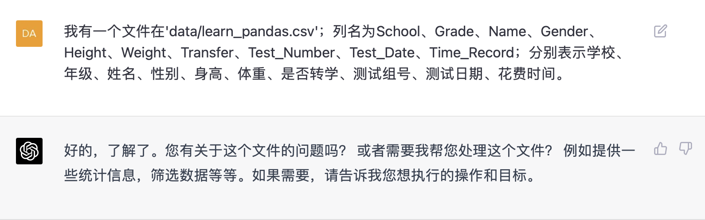
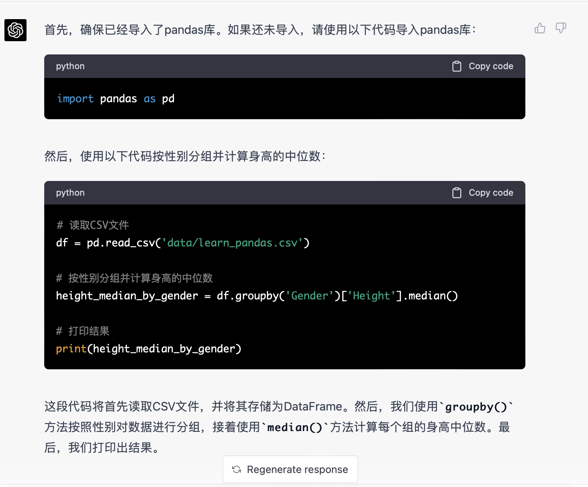
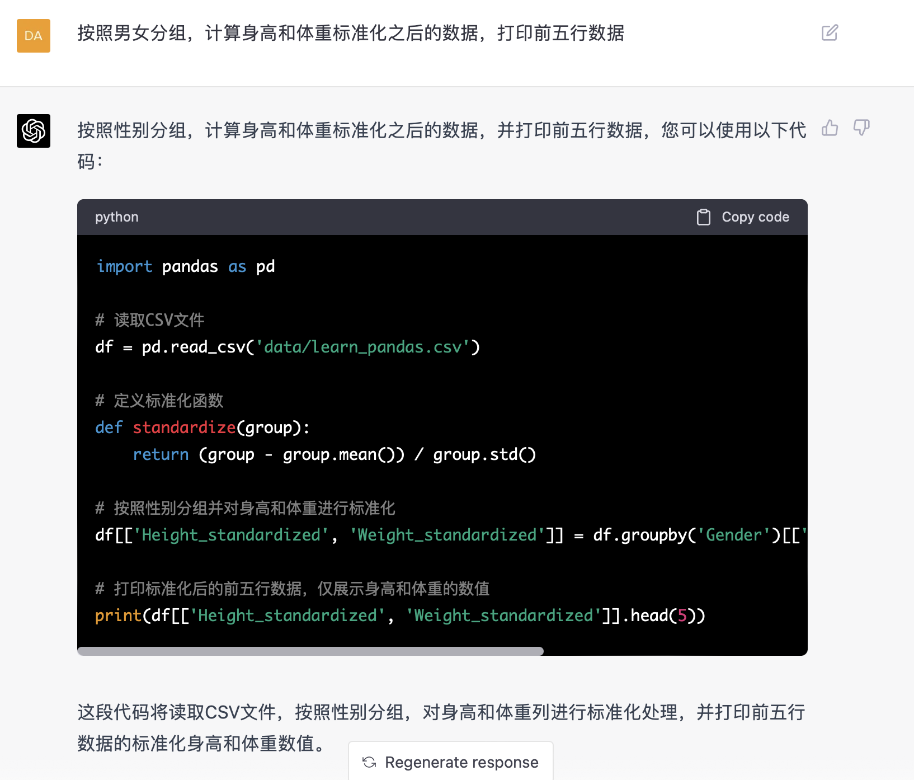
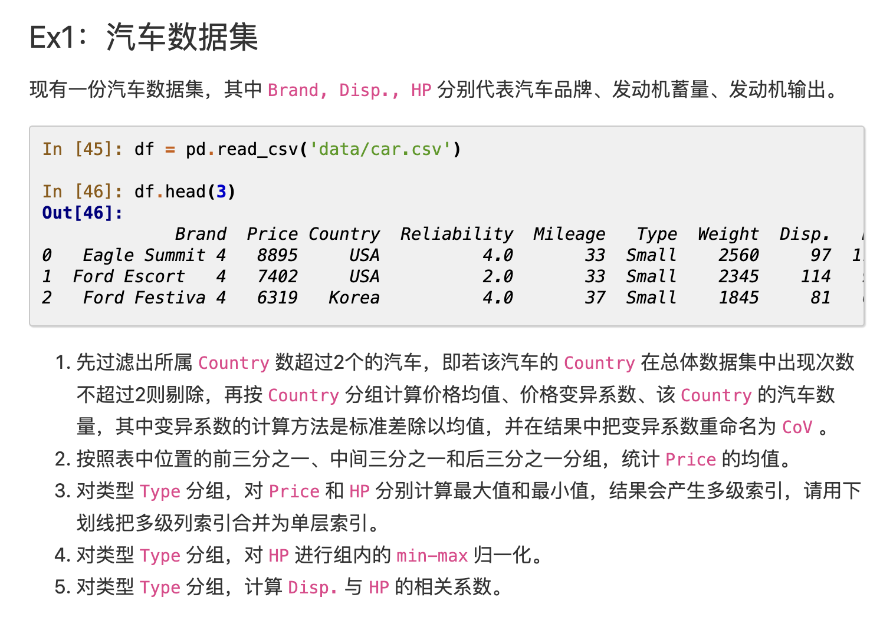

**案例：数据分析**

我们尝试用chatgpt写pandas来帮我们做数据分析。

为了检验chatgpt的代码，我们参考《joyful-pandas》里的内容进行比对检查。

选取joyful-pandas里第四章 -
分组的内容。见：http://joyfulpandas.datawhale.club/Content/ch4.html

**prompt测试**

首先让chatgpt知道文件在哪，以及文件的列名有哪些。

Excel文件在\'data/learn_pandas.csv\'；列名为School、Grade、Name、Gender、Height、Weight、Transfer、Test_Number、Test_Date、Time_Record；分别表示学校、年级、姓名、性别、身高、体重、是否转学、测试组号、测试日期、花费时间。

说明列名和列的意义是为了方便用中文和chatgpt交流。

Chatgpt表示它已经准备就绪了。

开始测试：请按照性别分组，统计身高中位数，给出pandas代码

它很贴心地提示先导入库，并且写了注释。直接拷贝代码看看结果。和教程的代码和结果做比较，完全正确。

  --------------------------------------------------------------------- ---------------------------------------------------------------------
  

  --------------------------------------------------------------------- ---------------------------------------------------------------------

测试一个复杂一点的，我希望按照男女分组后，计算身高和体重标准化后的数值。

结果也是正确的，只不过chatgpt给我们多加了两列标准化之后的数值，并且把所有的列数据都打印出来了。

如果希望像教程中一样只展示这两列数据，只需要多说一句：只打印标准化后的身高和体重数据即可，不用打印其他列。（不再演示）

  -------------------------------------------------------- ----------------------------------------------------------
  

  -------------------------------------------------------- ----------------------------------------------------------

看上去数据分析是Chatgpt的强项，只要把需求说清楚，它就能给出正确答案。

**练习题验证**

我们试一下练习题，看看直接把练习题拷贝输入chatgpt，是不是可以得到完全一样的答案。

先过滤出所属 Country 数超过2个的汽车，即若该汽车的 Country
在总体数据集中出现次数不超过2则剔除，再按 Country
分组计算价格均值、价格变异系数、该 Country
的汽车数量，其中变异系数的计算方法是标准差除以均值，并在结果中把变异系数重命名为
CoV 。

+-------------+-------------------+-----------------------------------+
| !           | {width="2.75in" |
| /folder4/me | 4/media/image10.p | height="0.8645833333333334in"}    |
| dia/image9. | ng){width="1.5in" |                                   |
| png){width= | height="0.822     | **参考答案**                      |
| "0.97916666 | 9166666666666in"} |                                   |
| 66666666in" |                   |                                   |
| height="    | **直接复制        |                                   |
| 0.791666666 | 代码运行的结果**  |                                   |
| 6666666in"} |                   |                                   |
|             |                   |                                   |
| **Chat      |                   |                                   |
| gpt的答案** |                   |                                   |
+-------------+-------------------+-----------------------------------+

按照表中位置的前三分之一、中间三分之一和后三分之一分组，统计 Price
的均值。

+---------------+----------------+------------------------------------+
| ![]           | {width="2.8020833333333335in" |
| der4/media/im | /image13.png){ | height="1.03125in"}                |
| age12.png){wi | width="1.26041 |                                    |
| dth="1.166666 | 66666666667in" | **参考答案**                       |
| 6666666667in" | heigh          |                                    |
| heig          | t="0.96875in"} |                                    |
| ht="0.9583333 |                |                                    |
| 333333334in"} | **直接复制代   |                                    |
|               | 码运行的结果** |                                    |
| **Ch          |                |                                    |
| atgpt的答案** |                |                                    |
+---------------+----------------+------------------------------------+

对类型 Type 分组，对 Price 和 HP
分别计算最大值和最小值，结果会产生多级索引，请用下划线把多级列索引合并为单层索引。

+------------------+-----------------+---------------------------------+
|  | dia/image16.png | g){width="2.5520833333333335in" |
| {width="1.375in" | ){width="1.3020 | height="1.15625in"}             |
| height="1.1145   | 833333333333in" |                                 |
| 833333333333in"} | height="1.10416 | **参考答案**                    |
|                  | 66666666667in"} |                                 |
| *                |                 |                                 |
| *Chatgpt的答案** | **直接复制代    |                                 |
|                  | 码运行的结果**  |                                 |
+------------------+-----------------+---------------------------------+

对类型 Type 分组，对 HP 进行组内的 min-max 归一化。

+----------------+--------------------+-------------------------------+
| {width="2.40625in" |
| /image18.png){ | 19.png){width="1.5 | height="0.96875in"}           |
| width="1.25in" | 833333333333333in" |                               |
| he             | height="0.9375in"} | **参考答案**                  |
| ight="0.916666 |                    |                               |
| 6666666666in"} | **直接复           |                               |
|                | 制代码运行的结果** |                               |
| **C            |                    |                               |
| hatgpt的答案** |                    |                               |
+----------------+--------------------+-------------------------------+

对类型 Type 分组，计算 Disp. 与 HP 的相关系数。

+--------------+---------------------------+--------------------------+
| {width="2.125in" | age23.png){width="2.0in" |
| 21.png){widt | heigh                     | height                   |
| h="1.1041666 | t="0.8645833333333334in"} | ="0.8541666666666666in"} |
| 666666667in" |                           |                          |
| height       | *                         | **参考答案**             |
| ="0.8125in"} | *直接复制代码运行的结果** |                          |
|              |                           |                          |
| **Cha        |                           |                          |
| tgpt的答案** |                           |                          |
+--------------+---------------------------+--------------------------+

检验结果，完全正确！
